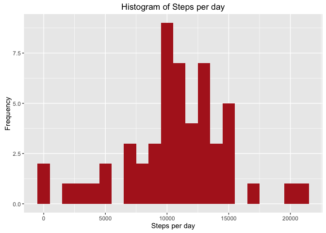
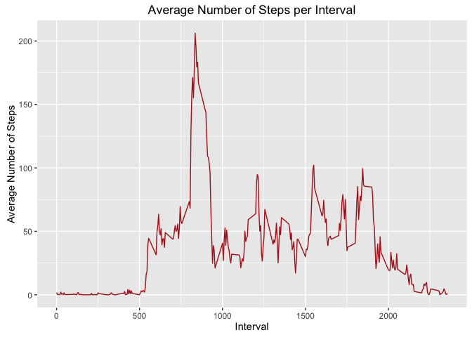
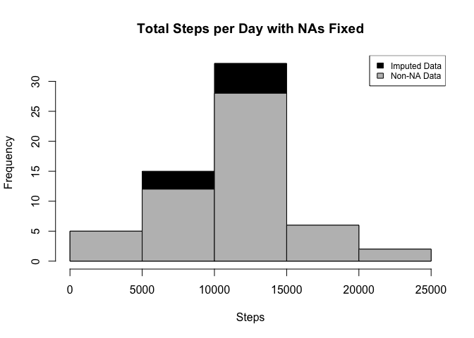
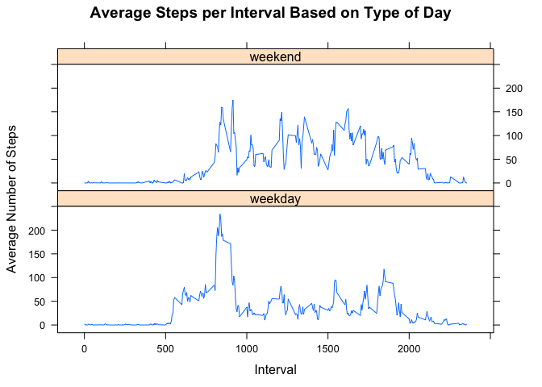

# Reproducible Research: Peer Assessment 1


R preparations & Loading in the necessary packages

```r
library(knitr)
opts_chunk$set(echo = TRUE)

library(dplyr)
```

```
## 
## Attaching package: 'dplyr'
```

```
## The following objects are masked from 'package:stats':
## 
##     filter, lag
```

```
## The following objects are masked from 'package:base':
## 
##     intersect, setdiff, setequal, union
```

```r
library(ggplot2)
```

```
## Warning: package 'ggplot2' was built under R version 3.2.4
```
## Loading and preprocessing the data


```r
activity <- read.csv("activity.csv", header = TRUE, sep = ',', colClasses = c("numeric", "character", "integer"))
activity$day <- weekdays(as.Date(activity$date))
activity$DateTime<- as.POSIXct(activity$date, format="%Y-%m-%d")
clean <- activity[!is.na(activity$steps),]
```

## What is mean total number of steps taken per day?

Calculate the total number of steps taken per day.


```r
sumTable <- aggregate(activity$steps ~ activity$date, FUN=sum, )
colnames(sumTable)<- c("Date", "Steps")
```

Make a histogram of the total number of steps taken each day.

```r
ggplot(sumTable, aes(Steps))+
        geom_histogram(fill = "firebrick", binwidth = 1000) +
        labs(title = "Histogram of Steps per day", x = "Steps per day", y = "Frequency")
```

<!-- -->

Calculate and report the mean and median of the total number of steps taken per day

```r
as.integer(mean(sumTable$Steps))
```

```
## [1] 10766
```

```r
as.integer(median(sumTable$Steps))
```

```
## [1] 10765
```


## What is the average daily activity pattern?

Make a time series plot (i.e. 𝚝𝚢𝚙𝚎 = "𝚕") of the 5-minute interval (x-axis) and the average number of steps taken, averaged across all days (y-axis)

```r
library(plyr)
```

```
## -------------------------------------------------------------------------
```

```
## You have loaded plyr after dplyr - this is likely to cause problems.
## If you need functions from both plyr and dplyr, please load plyr first, then dplyr:
## library(plyr); library(dplyr)
```

```
## -------------------------------------------------------------------------
```

```
## 
## Attaching package: 'plyr'
```

```
## The following objects are masked from 'package:dplyr':
## 
##     arrange, count, desc, failwith, id, mutate, rename, summarise,
##     summarize
```

```r
library(ggplot2)
clean <- activity[!is.na(activity$steps),]
intervalTable <- ddply(clean, .(interval), summarize, Avg = mean(steps))
p <- ggplot(intervalTable, aes(x=interval, y=Avg), xlab = "Interval", ylab="Average Number of Steps")
p + geom_line(color = "firebrick")+xlab("Interval")+ylab("Average Number of Steps")+ggtitle("Average Number of Steps per Interval")
```

<!-- -->

Which 5-minute interval, on average across all the days in the dataset, contains the maximum number of steps?

```r
maxSteps <- max(intervalTable$Avg)
intervalTable[intervalTable$Avg==maxSteps,1]
```

```
## [1] 835
```


## Imputing missing values

Calculate and report the total number of missing values in the dataset (i.e. the total number of rows with 𝙽𝙰s)

```r
nrow(activity[is.na(activity$steps),])
```

```
## [1] 2304
```

Devise a straregy for filling in all of the missing values in the dataset.

```r
avgTable <- ddply(clean, .(interval, day), summarize, Avg = mean(steps))
nadata<- activity[is.na(activity$steps),]
newdata<-merge(nadata, avgTable, by=c("interval", "day"))
```

Create a new dataset that is equal to the original dataset but with the missing data filled in.

```r
newdata2<- newdata[,c(6,4,1,2,5)]
colnames(newdata2)<- c("steps", "date", "interval", "day", "DateTime")
mergeData <- rbind(clean, newdata2)
```

Make a histogram of the total number of steps taken each day and Calculate and report the mean and median total number of steps taken per day. Do these values differ from the estimates from the first part of the assignment? What is the impact of imputing missing data on the estimates of the total daily number of steps?

```r
sumTable2 <- aggregate(mergeData$steps ~ mergeData$date, FUN=sum, )
colnames(sumTable2)<- c("Date", "Steps")
as.integer(mean(sumTable2$Steps))
```

```
## [1] 10821
```

```r
as.integer(median(sumTable2$Steps))
```

```
## [1] 11015
```

```r
hist(sumTable2$Steps, breaks=5, xlab="Steps", main = "Total Steps per Day with NAs Fixed", col="Black")
hist(sumTable$Steps, breaks=5, xlab="Steps", main = "Total Steps per Day with NAs Fixed", col="Grey", add=T)
legend("topright", c("Imputed Data", "Non-NA Data"), fill=c("black", "grey"), cex = 0.75 )
```

<!-- -->


## Are there differences in activity patterns between weekdays and weekends?

Create a new factor variable in the dataset with two levels – “weekday” and “weekend” indicating whether a given date is a weekday or weekend day.

```r
library(dplyr)
mergeData <- activity
mergeData$DayCategory <- ifelse(as.POSIXlt(mergeData$date)$wday %in% c(0,6), 'weekend', 'weekday')
steps.interval <- aggregate(steps ~ interval + DayCategory, mergeData, mean)
```

Make a panel plot containing a time series plot (i.e. 𝚝𝚢𝚙𝚎 = "𝚕") of the 5-minute interval (x-axis) and the average number of steps taken, averaged across all weekday days or weekend days (y-axis). See the README file in the GitHub repository to see an example of what this plot should look like using simulated data.

```r
library(lattice)
xyplot(steps~interval|DayCategory, data=steps.interval, type="l",  layout = c(1,2),
       main="Average Steps per Interval Based on Type of Day", 
       ylab="Average Number of Steps", xlab="Interval")
```

<!-- -->


